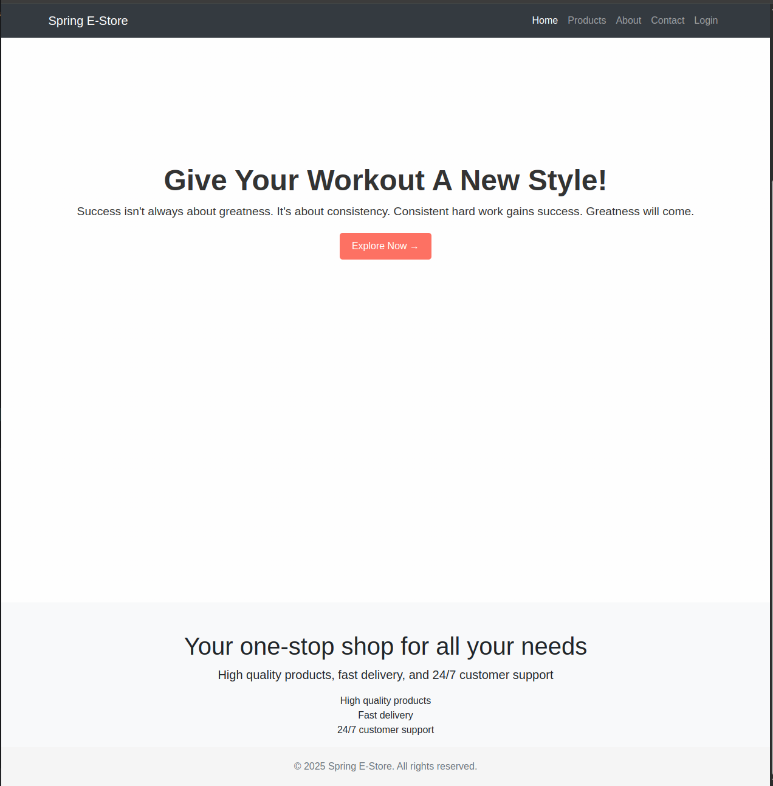

# Spring E-Store

Welcome to **Spring E-Store**, your one-stop solution for all your e-commerce needs. This project is built using Spring Boot and provides a robust platform for managing an online store.

## Features

- **Product Listings**: Browse a variety of products with detailed descriptions and prices.
- **Shopping Cart**: Add products to the cart and proceed to checkout.
- **Order Management**: Track your orders and view order history.
- **Customer Support**: 24/7 customer support for any queries or issues.
- **Responsive Design**: Mobile-friendly design using Bootstrap.
- **User Authentication**: Secure login and registration for users.
- **Admin Panel**: Manage products, orders, and users from an admin dashboard.
- **Payment Integration**: Seamless integration with popular payment gateways.
- **Dark Mode**: Toggle between light and dark themes for better user experience.

## Screenshots

### Home Page


### Product Page


### Shopping Cart


## Setup Instructions

Follow these steps to set up the project on your local machine:

1. **Clone the repository**:
    ```bash
    git clone https://github.com/yourusername/Spring_E-Store.git
    cd Spring_E-Store
    ```

2. **Place the icon images**:
    Ensure you have the following images in the `src/main/resources/static/images` directory:
    - `sun.png`
    - `moon.png`

3. **Set up the database**:
    - Install MySQL and create a database named `spring_estore`.
    - Update the `src/main/resources/application.properties` file with your database credentials:
      ```properties
      spring.datasource.url=jdbc:mysql://localhost:3306/spring_estore
      spring.datasource.username=your_username
      spring.datasource.password=your_password
      spring.jpa.hibernate.ddl-auto=update
      ```

4. **Build the project**:
    ```bash
    mvn clean install
    ```

5. **Run the application**:
    ```bash
    mvn spring-boot:run
    ```

6. **Access the application**:
    Open your web browser and go to `http://localhost:8080`.

7. **Login and Registration**:
    - Go to `http://localhost:8080/login` to login.
    - Go to `http://localhost:8080/register` to register a new account.

## Technologies Used

- **Backend**: Spring Boot, Spring Security, Spring Data JPA
- **Frontend**: HTML, CSS, Bootstrap, Thymeleaf
- **Database**: MySQL
- **Build Tool**: Maven

## Contributing

We welcome contributions to enhance the functionality and features of Spring E-Store. Please follow these steps to contribute:

1. Fork the repository.
2. Create a new branch (`git checkout -b feature-branch`).
3. Make your changes and commit them (`git commit -m 'Add new feature'`).
4. Push to the branch (`git push origin feature-branch`).
5. Create a pull request.

## License

This project is licensed under the MIT License. See the [LICENSE](LICENSE) file for details.

## Contact

For any queries or support, please contact us at support@springestore.com.

Thank you for considering Spring E-Store as your e-commerce solution. We look forward to serving you and making your online shopping experience seamless.

